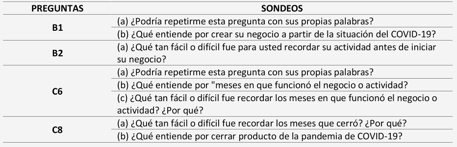

```{r setup, include=FALSE}
knitr::opts_chunk$set(fig.width=9, fig.height=3.5, fig.retina=3,
  out.width = "100%",
  cache = FALSE,
  echo = TRUE,
  message = FALSE, 
  warning = FALSE,
  fig.show = TRUE,
  hiline = TRUE)
```

```{r packages, include = F}
library(xaringanthemer)
#remotes::install_github("gadenbuie/xaringanthemer")

```

# Contenido

--

**1) Contexto:** ¿Qué es la Encuesta de Microempendimiento?

--

**2) Enmarque:** ¿Cómo se relaciona esta encuesta con el contenido de este curso?  

--

**3) Contenido:**

--

→ ¿Qué hace la EME para diseñar y testar sus cuestionarios?
  * Revisión de Expertos
  * Pruebas QAS
  * Entrevistas Cognitivas
  * Pruebas de Usabilidad
  * Piloto VII EME
  * Grupos Focales Recolectores (*Interviewer Debriefings*)
  
--

→ ¿Qué hace la EME para asegurar la calidad de los datos durante la recolección?
  * Supervisiones
  * Grillas de Suficiencia
  * Observaciones Técnicas
---
# Contenido

**1) Contexto:** ¿Qué es la Encuesta de Microempendimiento?

**2) Enmarque:** ¿Cómo se relaciona esta encuesta con el contenido de este curso?  

**3) Contenido:**  
¿Qué hace la EME para diseñar y testar sus cuestionarios?  
¿Qué hace la EME para asegurar la calidad de los datos durante la recolección?

--

**4) Reflexiones finales:**  
¿Cómo se relacionan las prácticas de la ENE con el aseguramiento de la confiabilidad y la validez?

---
class: middle

# ¿Qué es la Encuesta de 
# Microemprendimiento (EME)?

---
## Encuesta Microemprendimiento

> Encuesta a hogares donde residan microemprendedores que realiza el Instituto Nacional de Estadísticas   
por solicitud del Ministeriode Economía, Fomento y Turismo. El INE hace esta encusta desde el 2013  
y se efectúa cada dos años.
---

## Encuesta Microemprendimiento


--

### Objetivo General

--

> Caracterizar los microemprendimientos que se desarrollan a nivel nacional, permitiendo conocer  
las limitantes y los elementos facilitadores que tienen las unidades económicas de menor tamaño  
para llevar a cabo sus actividades dentro del mercado laboral. Esto considerando, una muestra  
representativa  de viviendas particulares que contienen al menos a un microemprendedor, a nivel  
nacional y regional [(INE 2020, p.7)](https://www.economia.gob.cl/wp-content/uploads/2020/03/Manual-de-Usuarios-base-EME-6.pdf)

--

En otras palabras...

---
class: middle

###.large[Caracterizar la heterogénea realidad de los   
microemprendedores del país, sus negocios  
y su evolución en el tiempo]


.left[]
---
## Encuesta Microemprendimiento

--

### Objetivos especificos

--


---
## Encuesta Microemprendimiento

--

### Algunos aspectos técnicos de la versión VI...

--

- **Población Objetivo:**

--

> Trabajadores por **cuenta propia** o personas **empleadoras** dueñas de una microempresa con **hasta 10  
trabajadores y/o trabajadoras** (incluyendo a la o el informante dueño de la unidad económica),  
denominadas en su conjunto como personas microemprendedoras, que residen en viviendas particulares  
ocupadas dentro del territorio nacional

--

- **Fuente de Información:**

--

> Encuesta a hogares aplicada al informante directo

---
## Encuesta Microemprendimiento

### Algunos aspectos técnicos de la versión VI...

--

- **Diseño Muestral:**

--

> <ins>Diseño muestral bifásico:</ins> en la primera fase se identificaron las viviendas donde reside al menos un  
trabajador independiente, a través de la Encuesta Nacional de Empleo (ENE). Luego, en la segunda fase,  
se realiza una encuesta a trabajadores por cuenta propia y empleadores dueños de una unidad económica  
con hasta 10 trabajadores (incluyendo al dueño de la unidad económica).

--

> <ins>Período de referencia:</ins> se obtiene de la muestra: trimestre marzo-mayo de 2019  
de la Encuesta Nacional de Empleo.

--

> <ins>Representatividad a nivel regional y nacional.</ins> Error muestral teórico: 1,3% para el estimador principal  
(proporción de personas que trabajan por cuenta propia sobre el total de microemprendedores)

---
## Encuesta Microemprendimiento

### Algunos aspectos técnicos de la versión VI...

- **Tamaño de la muestra:** El tamaño de la muestra teórica es de 8.469 viviendas (9.227
informantes en total).

--

- **Período de levantamiento:** La encuesta fue levantada entre la segunda semana de mayo  
hasta la primera de agosto de 2019 (3 meses).

--

- **Cobertura geográfica:** Cobertura del área urbana y rural a nivel nacional.

--

- **Modo de aplicación:** Presencial, entrevista personal con cuestionario en papel

--

- **Duración promedio:** 28,4 minutos por cuestionario.

--

- **Cobertura temática:** Encuesta compuesta por 12 módulos, con 97 preguntas en total.

---
class: middle

# ¿Cómo se relaciona esta encuesta con el contenido de este curso?
---
## Porque...

--

> ###.large[La EME es un ejemplo de una encuesta que debe  
pasar por distintos procesos de pre-testeo y aseguramiento  
de calidad. Especialmente considerando que...]

--

- Busca generar datos inferenciales (es una encuesta probabilistica)

--

- Tiene los recursos necesarios

--

- Busca generar estadísticas **oficiales** del país

---
class: middle

# ¿Qué hace la EME para diseñar y testear 
# sus cuestionarios?

---

## Un paso previo: ¿Qué buscamos con el testeo de cuestionarios

--

El objetivo del pretesteo de cuestionarios es desarrollar instrumentos que sean: 

--

1) Confiables (*reliable*) 

--

2) Válidos (*valid*)  

--

3) Estándar (comparables) 

--

4) Fáciles de administrar

--

.left[.small[Fuente: Casas-Cordero (2021)]]

---

## Un paso previo: ¿Qué buscamos con el testeo de cuestionarios

--
### Algunos problemas al responder cuestionarios...

--

1) Falla al registrar la información que se busca. 

--

2) Interpretación incorrecta de la pregunta. 

--

3) Olvido y otros problemas de la memoria.

--

4) Estrategias incorrectas de Estimación o Juicio. 

--

5) Problemas al formatear la respuesta.

--

6) Alteración de respuestas. 

--

7) Falla en seguir instrucciones.

--

.left[.small[Fuente: Casas-Cordero (2021)]]

---
## Estándares para la evaluación de cuestionarios

--

Groves et al. (2009) menciona 3 estándares que toda pregunta debe cumplir: 

--

**1. Estándares de contenido**  

• ¿Las preguntas están capturando lo que se requiere?

--

**2. Estándares cognitivos** 

• ¿Los entrevistados entienden las preguntas en forma consistente? 

• ¿Tienen la información que requieren para responder? 

• ¿Están dispuestos a formular respuestas a las preguntas?

--

**3. Estándares de usabilidad** 

• ¿Pueden los entrevistados y encuestadores completar el cuestionario  
en forma fácil y de la forma en que se definió?

--

.left[.small[Fuente: Casas-Cordero (2021)]]

---
## Estándares y técnicas de evaluación

--


.left[.small[Fuente: Casas-Cordero (2021)]]
---
## Estándares y técnicas de evaluación

--


.left[.small[Fuente: Casas-Cordero (2021)]]
---
## Revisión de Expertos

--

### .large[Expertos en la temática y en metodología de encuestas  
revisan una versión borrador del cuestionario.]

--

Esto implica revisar...

--

- El fraseo de las preguntas

--

- La estructura de las preguntas

--

- Las alternativas de respuesta

--

- El orden de las preguntas

--

- Instrucciones a los recolectores para aplicar el cuerstionario

--

- Las reglas respecto a los flujos del cuestionario

---
## Pruebas QAS

--

### .large[_Question Appraisal System (QAS)_ es un instrumento creado  
por Willis & Lesler (1999) para evaluar de forma sistemática  
las preguntas y respuestas de un cuestionario]

--

Algunas características:

--

- Permite recoger las opiniones de distintos expertos de forma sistemática

--

- Relativamente fácil de usar

--

- Está pre-codificado y cuanta con un algoritmo de clasificación automática.

--

- Bajo costo

---
## Pruebas QAS

--

### .large[Está codificado en torno a problemas comunes que se pueden  
detectar de un cuestionario. Por ejemplo:]

--

1) Sintaxis compleja

--

2) Excesivamente demandante para la memoria

--

3) Frases vagas o ambiguas

--

4) Concepto técnico poco familiar

--

5) Concepto vago o ambiguo

--

6) Supuesto impreciso

---

## Pruebas QAS

### .large[Está codificado en torno a problemas comunes que se pueden  
detectar de un cuestionario. Por ejemplo:]

--

7) Categorías de la pregunta poco claras

--

8) Combinación de dos categorías de respuesta

--

9) Desajuste entre pregunta y opciones de respuesta

--

10) Información difícil de recopilar (sensible)

--

11) Poco probable que el informante sepa la respuesta


--

12) Proposito de la pregunta poco claro

---
## Pruebas QAS: EME

--

- Instrumento aplicado a dos analistas expertos  

--

- Se testearon 31 de las 97 preguntas del cuestionario (32%)  

--

- Se priorizaron modulos y preguntas que en versiones pasadas habían presentado inconvenientes en   
su forma o contenido  

--

- Los resultados fueron principalmente relacionados a las formas de aplicación

--

#### Ejemplos de recomendaciones:

> Se recomienda homologar los criterios en el uso de cursivas en las preguntas, dejando su uso exclusivamente para cuando se trate de instrucciones para las y los encuestadores.

> La pregunta F2 fue reformulada para hacerla coherente con la forma en que debe ser llenada

---
## Entrevistas Cognitivas

--

> Instrumento que permite identificar distintos problemas que pueden presentar las y los informantes  
al momento de responder una pregunta, principalmente relacionados a la **comprensión, recuperación  
de información, estimación o cálculo**, entre otras. La identificación de estos hallazgos, entrega insumos  
útiles para realizar modificaciones en las preguntas con el objetivo de generar información estadística  
valida y confiable (INE, 2013, p.3)  

--


> Son aquellas donde los encuestadores administran preguntas borradores en entrevistas individualizadas,  
indagando como los informantes comprenden las preguntas y formulan sus respuestas  
(Groves, 2009, p.260)

--

Dicho de otra forma:

--

###.large[**Se indaga en el proceso de respuesta del informante,  
preguntandole (de forma indirecta) si comprende lo que  
se pregunta y cómo llega a su respuesta**]

---
## Entrevistas Cognitivas

--


     
.small[Fuente: Groves (2004) en INE (2013)]

---
## Entrevistas Cognitivas: VII EME

--

**Paso 1: Priorización de módulos y preguntas (cuestionario muy extenso)**

--


---
## Entrevistas Cognitivas: VII EME

--

**Paso 2: Elaboración de Pauta**

--


     
---
## Entrevistas Cognitivas: VII EME

--

**Paso 3: Perfiles a entrevistar**

--

- Muestra (bola de nieve): 12 personas

- Criterios de selección: proporcionalidad ramas económicas, sexo y edad


---
## Entrevistas Cognitivas: VII EME

--

**Paso 4: Reclutamiento**

- Bola de nieve a partir de los análistas del equipo y practicantes  

--

**Paso 5: Transcripción y codificación**

- Transcripción textual de .mp4 (Zoom) a Excel

- Codificación de tres opciones: 

a. Comprende la pregunta  
b. si había una comprensión incompleta  
c. no se comprendía. 

---

---
## Pruebas de Usabilidad

--

###.large[Poner a prueba la aplicación del cuestionario a un grupo  
pequeño de la población de estudio, poniendo foco en la  
experiencia de aplicar y responder el cuestionario.]

--

Se tiene en consideración aspectos como: 

--

- Modo de aplicación del cuestionario (nuevas herramientas tecnológicas)

--

- Duración

--

- Flujos y filtros correctos

---
## Pruebas de Usabilidad: EME

--

### Características

<ins>Objetivo:</ins> Evaluar la aplicación del cuestionario en la plataforma _Survey Solutions_ (SuSo) en terminos de flujo,  
modo y modalidad.

<ins>Recolectores:</ins> 11 profesionales del INE

<ins>Muestra:</ins> 40 microemprendedores(20 por modalidad) elegidos por bola de nieve.

---
### Pruebas de Usabilidad: EME

--

### Puntos importantes para la aplicación

- **Paso 1: Diseño y capacitación de protocolo de la técnica**
- **Paso 2: Aplicación entrevistas**
- **Paso 3: Sistematización hallazgos recolectores**
- **Paso 4: Grupos focales recolectores**
- **Paso 5: Analisis base de datos**
---
## Prueba Piloto VII EME 

Evaluar el avance del levantamiento de datos a través de indicadores operativos y herramientas cualitativas,  
especialmente a través de los distintos grupos de estudio correspondientes a la prueba piloto: 

- _Papel and Pencil Personal Interviewing_ (PAPI)
- _Computer Assisted Personal Interviewing_ (CAPI)
- _Computer Assisted Telefonic Interviewing_ (CATI).

---
## *Interviewer Debriefings*

---
class: middle

# ¿Qué hace la EME para asegurar la 
# calidad de los datos durante la 
# recolección?

---
## Supervisiones: 

--

Profesionales encargados de supervisar directamente el momento de la recolección e indirectamente la  
información recolectada. Las encuestas a supervisar pueden ser aleatorias o a solicitud de ciertos cargos  
dentro del proceso de recolección.

--

## Grilla de Suficiencia

--

Instrumento que asigna puntajes de suficiencia a casos de entrevista, en base a ciertos test de validación a  
preguntas importantes del cuestionario. Si el caso no cumple con un puntaje mínimo de suficiencia  
es devuelto al recolector para que corrobore y/o recopile la información restante.

## Observaciones Técnicas

--

Observación no participante del proceso de aplicación del cuestionario de parte de integrantes del Equipo Técnico.  
Busca evaluar, por un lado, que los recolectores estén siguiendo las directrices dadas en las capacitaciones y,  
por otro, identificar dificultades en el proceso de respuesta de parte del informante. Los hallazgos del observador  
se sistematizan y retroalimentan al equipo de recolección para que incorpore ciertas recomendaciones.
---
class: middle

# ¿Cómo se relacionan las prácticas de la
# EME con el aseguramiento de la 
# confiabilidad y la validez?
---
class: center, middle

# ¡Muchas gracias!