```{r setup, include=FALSE}
knitr::opts_chunk$set(fig.width=9, fig.height=3.5, fig.retina=3,
  out.width = "100%",
  cache = FALSE,
  echo = TRUE,
  message = FALSE, 
  warning = FALSE,
  fig.show = TRUE,
  hiline = TRUE)
```


```{r packages, include = F}
library(xaringanthemer)
#remotes::install_github("gadenbuie/xaringanthemer")

```

# Contenido

--

**1) Contexto:** ¿Cómo el INE planifica y diseña sus productos estadísticos? 

--

**2) Encuesta de Microemprendimiento (EME):**

¿Qué hace la EME para diseñar y testar sus cuestionarios?

--

**3) Conclusiones:**  
¿Cómo se relacionan las prácticas de la ENE con el aseguramiento de la confiabilidad y la validez?

---
# .large[ ¿Cómo el INE planifica y diseña sus  
productos estadísticos?]

--

## _Generic Statistical Process Model (GSBPM)_


--

> El GSBPM describe y define el conjunto de procesos necesarios para producir estadísticas  
oficiales. Proporciona un marco estándar y una terminología armonizada para ayudar a las  
organizaciones estadísticas a modernizar sus procesos de producción estadística, así como  
a compartir métodos y componentes (CEPE, 2019, p.3).

--


### .large[En otras palabras: es un marco general para la producción   
de estadísticas oficiales]
---
# GSBPM
## Algunas caractarísticas...

--

- En 2019 el INE adopta este marco como guía para la producción de sus encuestas

--

- Esto implica que la planificación y diseño de los productos sigue una lógica de procesos

--

> Un proceso estadístico es un conjunto de actividades y tareas relacionadas y estructuradas  
para convertir los datos de entrada en información estadística.

--

## Procesos

--

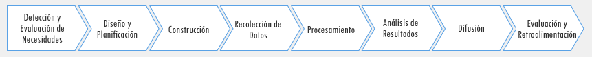

---

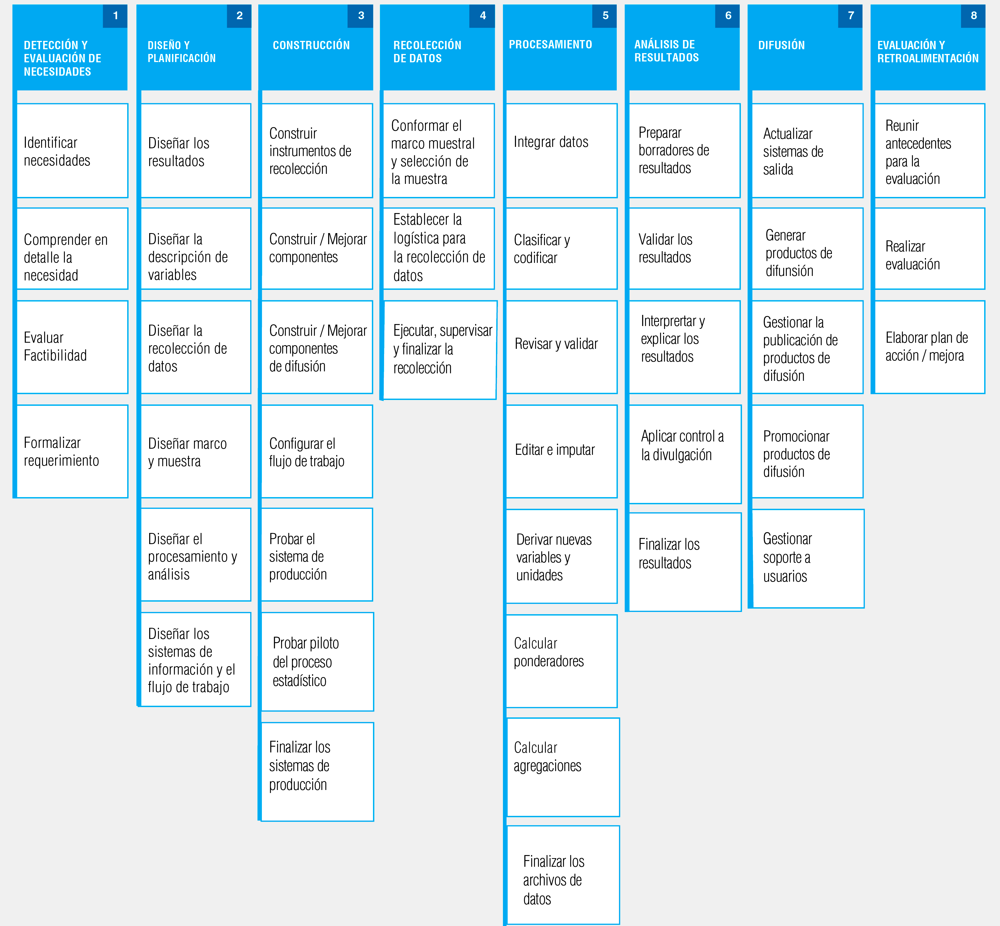


---
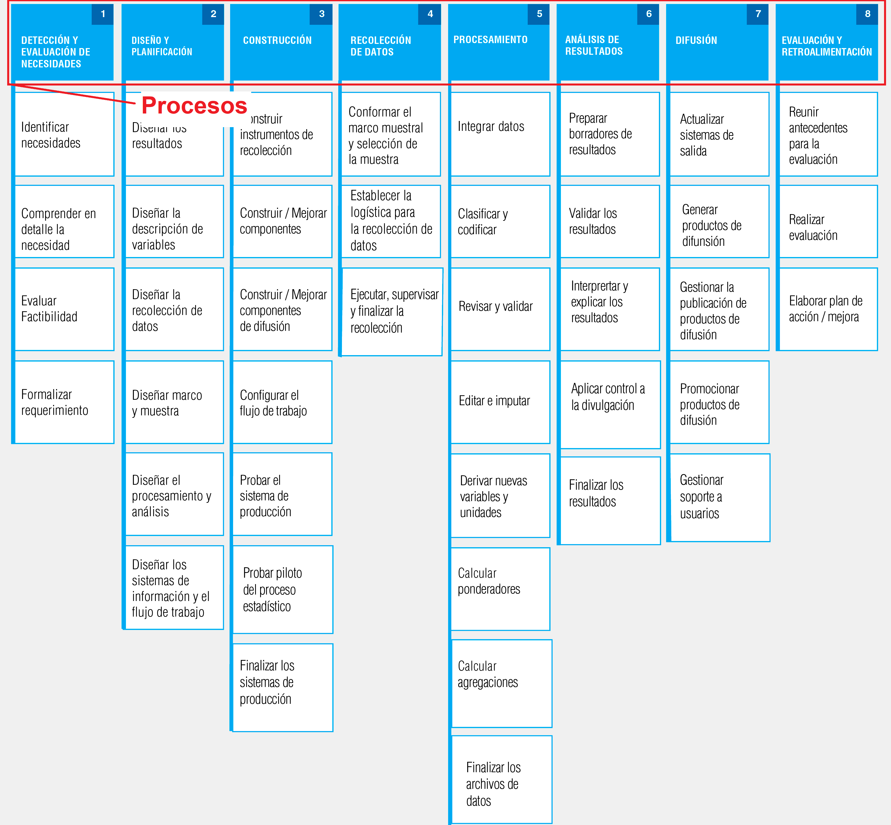

---

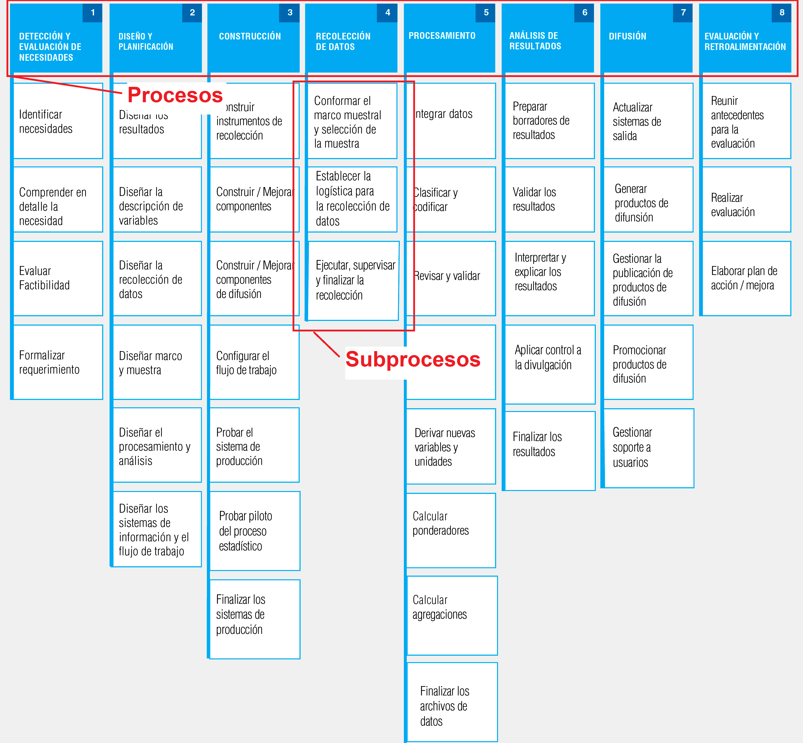

---

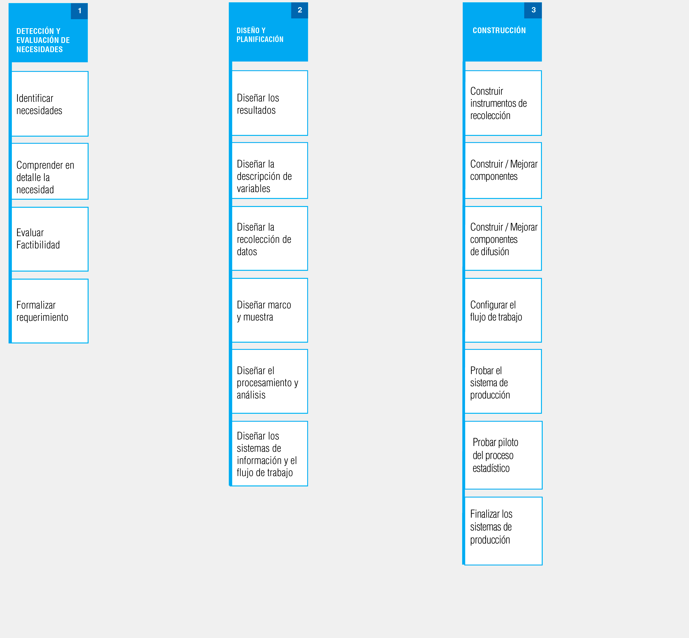
---

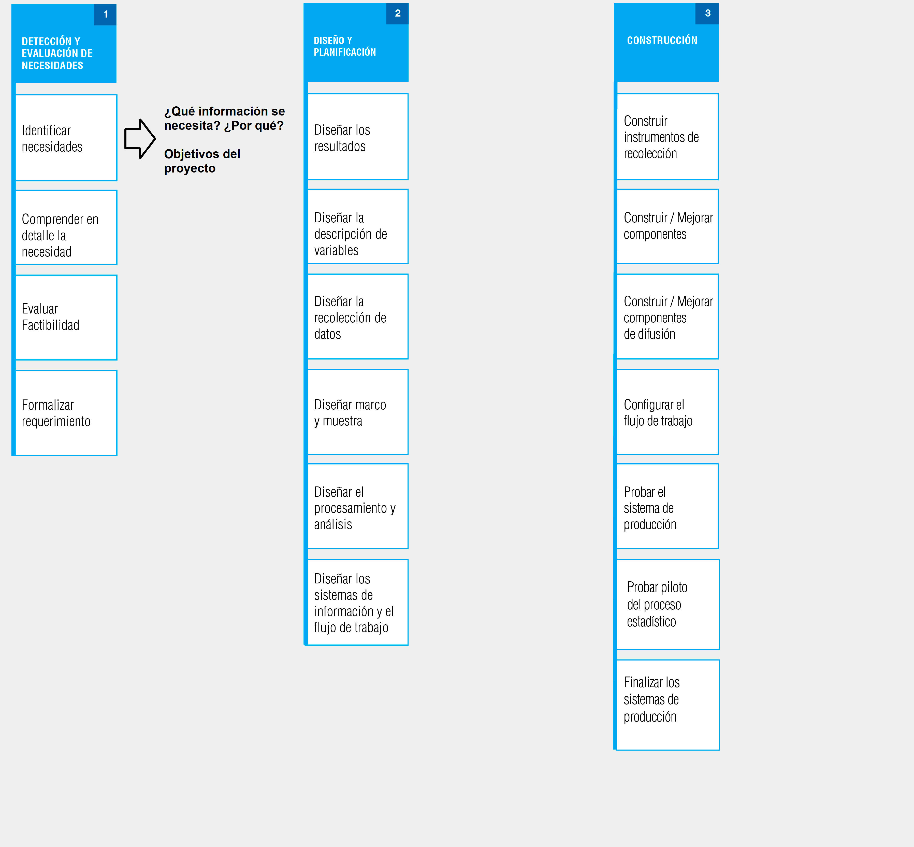
---

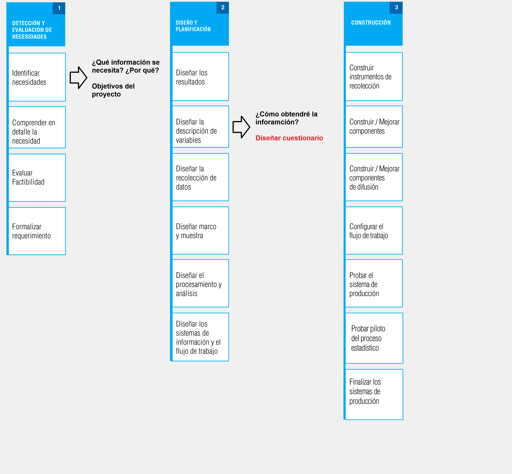
---

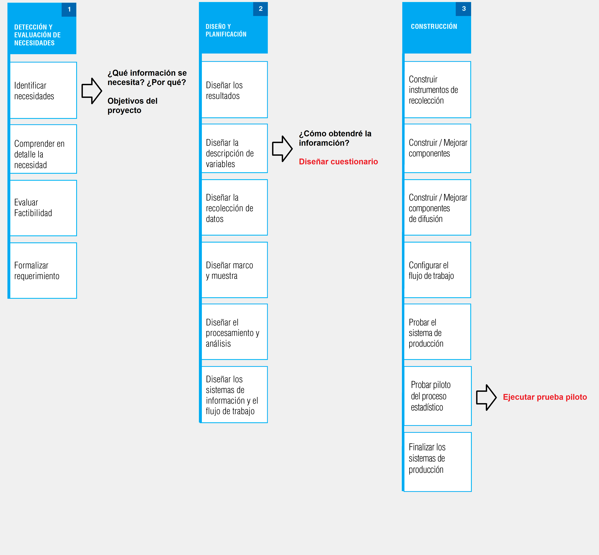
---

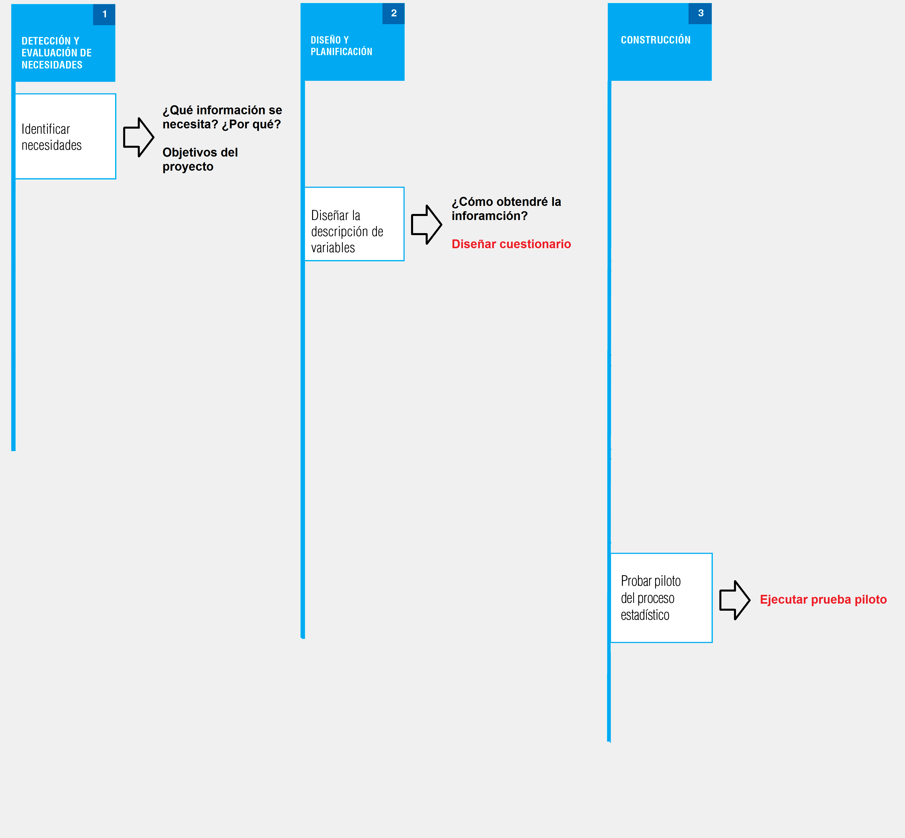
---
class: middle

# .large[Encuesta de Microemprendimiento  
(EME)]

---
## Encuesta Microemprendimiento

--

### .large[Encuesta a hogares donde residan microemprendedores que  
realiza el Instituto Nacional de Estadísticas por solicitud del  
Ministerio de Economía, Fomento y Turismo. El INE hace esta  
encuesta desde el 2013 y se efectúa cada dos años.]
---

## Encuesta Microemprendimiento


--

### Objetivo General

--

> Caracterizar los microemprendimientos que se desarrollan a nivel nacional, permitiendo conocer  
las limitantes y los elementos facilitadores que tienen las unidades económicas de menor tamaño  
para llevar a cabo sus actividades dentro del mercado laboral. Esto considerando, una muestra  
representativa  de viviendas particulares que contienen al menos a un microemprendedor, a nivel  
nacional y regional [(INE 2020, p.7)](https://www.economia.gob.cl/wp-content/uploads/2020/03/Manual-de-Usuarios-base-EME-6.pdf)

--

En otras palabras...

---
class: middle

###.large[Caracterizar la heterogénea realidad de los   
microemprendedores del país, sus negocios  
y su evolución en el tiempo]


.left[]
---
## Encuesta Microemprendimiento

--

### Objetivos especificos

--


---
class: middle

# ¿Qué hace la EME para diseñar y testear 
# sus cuestionarios?

---

## Un paso previo: ¿Qué buscamos con el testeo de cuestionarios?

--

El objetivo del pretesteo de cuestionarios es desarrollar instrumentos que sean: 

--

**1) Confiables** (*reliable*) → Consistencia entre mediciones

--

**2) Válidos** (*valid*) → Las inferencias sobre los puntajes (ej. Indice de criminalidad) tienen sentido  
con la evidencia acumulada

--

**3) Estándar** (comparables)

--

**4) Fáciles de administrar***


---

## Un paso previo: ¿Qué buscamos con el testeo de cuestionarios

--
### Algunos problemas al responder cuestionarios...

--

1) Falla al registrar la información que se busca. 

--

2) Interpretación incorrecta de la pregunta. 

--

3) Olvido y otros problemas de la memoria.

--

4) Estrategias incorrectas de Estimación o Juicio. 

--

5) Problemas al formatear la respuesta.

--

6) Alteración de respuestas. 

--

7) Falla en seguir instrucciones.

---
## Estándares para la evaluación de cuestionarios

--

Groves et al. (2009) menciona 3 estándares que toda pregunta debe cumplir: 

--

**1. Estándares de contenido**  

• ¿Las preguntas están capturando lo que se requiere?

--

**2. Estándares cognitivos** 

• ¿Los entrevistados entienden las preguntas en forma consistente? 

• ¿Tienen la información que requieren para responder? 

• ¿Están dispuestos a formular respuestas a las preguntas?

--

**3. Estándares de usabilidad** 

• ¿Pueden los entrevistados y encuestadores completar el cuestionario  
en forma fácil y de la forma en que se definió?

--

.left[.small[Fuente: Casas-Cordero (2021)]]

---
## Estándares y técnicas de evaluación

Distintos estándares pueden ser abordados por una misma técnica de evaluación, por ejemplo:  

.pull-left[#### Estándar Contenido

- Revisión de Expertos → las preguntas recogen la información requerida para los análisis

- Entrevistas Cognitivas → las preguntas recogen la información que se busca
]

.pull-rigt[#### Estándar Cognitivo
- Revisión de Expertos → identifica términos  
ambiguos, tareas complejas

- Entrevistas Cognitivas → los entrevistados pueden  
entender y responder las preguntas
]

.pull-left[#### Estándar de Usabilidad

- Revisión de Expertos → identifican preguntas  
que podrían causar problemas a  
entrevistados o encuestadores.

- Pruebas Piloto → evalúa como funciona  
el cuestionario en la práctica
]
---
# Flujo EME

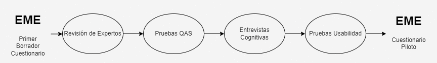
---
# Revisión de Expertos

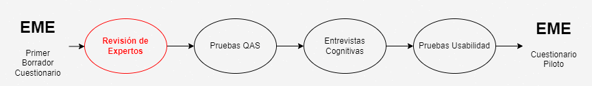

- Se reúnen expertos del INE y del Ministerio de Economía para revisar el cuestionario de la  
versión anterior de la EME.

- Se toma como antecedentes los hallazgos y dificultades de la versión pasada  

- Se proponen cambios al cuestionario y se discuten con el equipo técnico
---
# Pruebas QAS (_Question Appraisal System_)

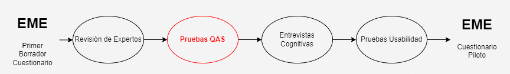

- Instrumento tipo plantilla que permite sistematizar la opinión de varios expertos  
en torno a los problemas en ciertas preguntas del cuestionario

- Se testearon 31 de las 97 preguntas del cuestionario (32%) a dos analistas expertos

- Se priorizaron módulos y preguntas que en versiones pasadas habían presentado inconvenientes en   
su forma o contenido  

- Los resultados fueron principalmente relacionados a las formas de aplicación
---
# Pruebas QAS (_Question Appraisal System_)


#### Ejemplos de recomendaciones:

> Se recomienda homologar los criterios en el uso de cursivas en las preguntas, dejando su uso  
exclusivamente para cuando se trate de instrucciones para las y los encuestadores.

> La pregunta F2 fue reformulada para hacerla coherente con la forma en que debe ser llenada

---
# Entrevistas Cognitivas

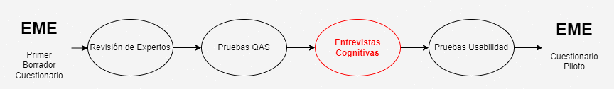

- Instrumento que permite identificar dificultades en el proceso de respeusta del informante,  
indagando si comprenden las preguintas y cómo formulan sus respuestas

Priorización Preguntas → Elaboración Pauta → Muestreo y Reclutamiento → Ejecución y Codificación

---
# Entrevistas Cognitivas

**Priorización Preguntas**


---
# Entrevistas Cognitivas

**Elaboración Pauta**


     
---
# Entrevistas Cognitivas

**Muestreo y Reclutamiento**

- Muestra (bola de nieve): 12 personas

- Criterios de selección: proporcionalidad ramas económicas, sexo y edad


---
# Entrevistas Cognitivas


**Ejecución y Codificación**

- Ejecución por experto en encuestas en ambiente controlado

- Transcripción textual de .mp4 (Zoom) a Excel

- Codificación de tres opciones: 

a. Comprende la pregunta  
b. Comprensión incompleta  
c. No se comprende. 

---

---
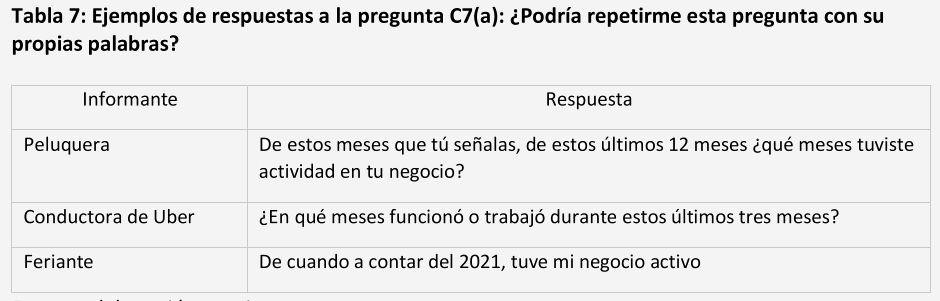
     
---

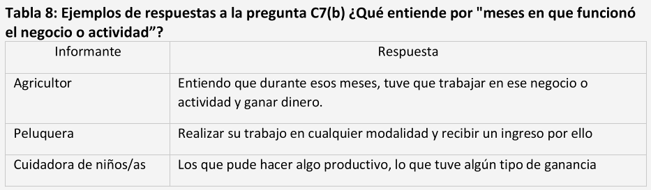

---

# Pruebas Usabilidad

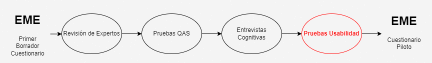


- Poner a prueba la aplicación del cuestionario a un grupo pequeño de la población  
de estudio, poniendo foco en la experiencia de aplicar y responder el cuestionario

- 2 pruebas de usabilidad para poner a prueba el uso de nueva plataforma digital (Survey Solutions).

- 11 recolectores, 40 microemprendedores reclutados por bola de nieve
---
## Pruebas Pilotos (Prueba de Campo Convencional)

--

> La forma convencional de pretesteo es esencialmente un **ensayo general**, en el que los encuestadores  
reciben el mismo tipo de entrenamiento que el de la encuesta principal y administran el cuestionario  
de la misma forma en que lo harían durante la encuesta propiamente tal  
(Presser, 2004 en Casas-Cordero, 2021)

--

> Después de que cada encuestador completa unas cuantas entrevistas, se puede tabular la distribución  
de las respuestas y se realiza una **sesión de discusión** donde los encuestadores relatan sus experiencias  
con el cuestionario y ofrecen su visión acerca de los problemas del cuestionario  
(Idem)

---
## Pruebas Pilotos (Prueba de Campo Convencional)
### Objetivos

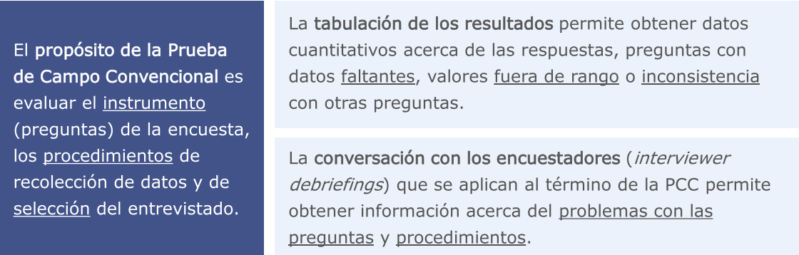
     
---
## Prueba Piloto VII EME 

--

### Objetivos Generales

--
         
> Estimar el **impacto del cambio en el medio** (desde encuesta en papel a Dispositivo de Captura Móvil  
(DMC)) y del **modo** de recolección (telefónico) de la encuesta, en los principales indicadores.

--

> Evaluar la **inclusión de nuevas preguntas** que tenían por objetivo medir el impacto de la pandemia  
COVID – 19 en las personas microemprendedoras y sus negocios, conocer grados de digitalización y   
actualizar la metodología de captura del tiempo dedicado al trabajo no remunerado (Idem)

--


La prueba se diseñó siguiendo una **lógica experimental**, construyendo grupos de estudio en función del  
medio (vía por la cual se registra la información) y modo (formato por el cual se aplica la encuesta)

--

- **Medio:** DMC (Tablet) o Papel
- **Modo:** Telefónico o Presencial

---
## Prueba Piloto VII EME 

--

### Construcción grupos de estudio

--

A partir de las combinaciones del modo y medio de recolección, se construyeron los grupos de estudio

--

- Presencial-Papel → _Papel and Pencil Personal Interviewing_ (PAPI)
- Presencial-DMC → _Computer Assisted Personal Interviewing_ (CAPI)
- Telefónica-DMC → _Computer Assisted Telefonic Interviewing_ (CATI)

--

En términos concretos...

--

Se comparan distintos indicadores entre grupos de estudio. Siendo PAPI el grupo de control,  
se compara CAPI y CATI con este.

---
## Prueba Piloto VII EME

--

### Características de la recolección

--

- Muestra teórica de 1007 informantes

--

- Muestra objetivo de 600 informantes

--

- Muestra lograda de 554 informantes (102.5% PAPI, 94.5% CAPI y 80% CATI)

--

- Cobertura de Región Metropolitana

--

- 12 recolectores*

--

- Grupos de estudio asignados de forma probabilistica

--

- Enero y Febrero 2022
---
## Algunos análisis

#### Indicadores Principales

--

- Número de trabajadores por cuenta propia
- Número de microemprendedores informales
- Número de microemprendedores sin acceso a seguridad social

--

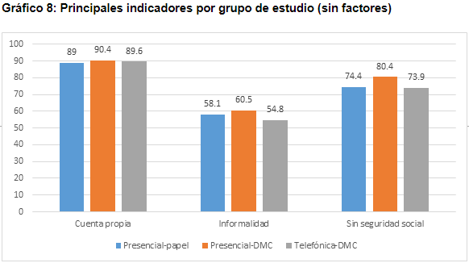

---
## Algunos análisis
#### Indicadores Operativos

--

- Tasa de Rechazo (Total rechazadas/Total elegibles*100)

--

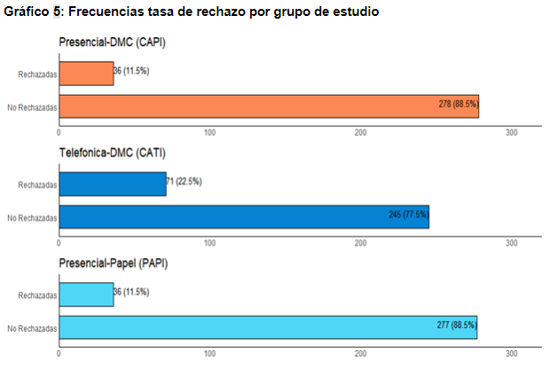
     
---
## Algunos análisis
#### Duración

--

- Duración del cuestionario

--

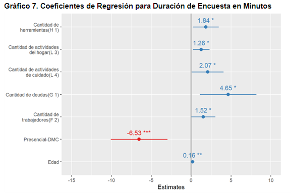
---
## Algunos análisis
#### Respuesta/No Respuesta

--

- Predictores de la Respuesta

--

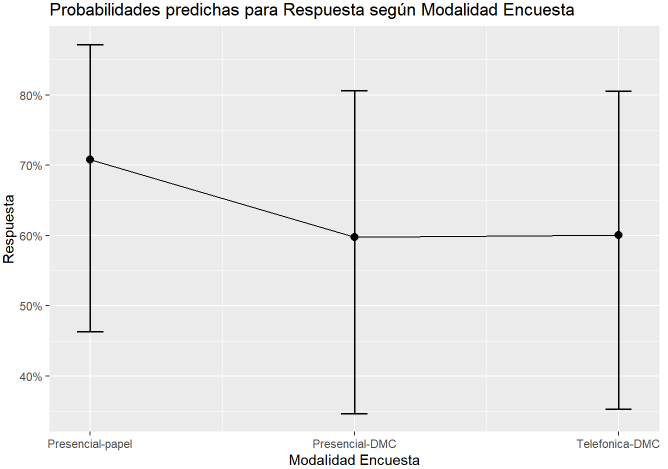

---
## Algunos aprendizajes y resultados

--

- No existen diferencias estadísticamente significativas en indicadores principales de la EME

--

- La aplicación por teléfono genera más desconfianza en los informantes, pero ahorra recursos  
de tiempo, dinero y capital humano

--

- Items que aumentan la duración del cuestionario o items con poca varianza

--

- Experiencia de uso del SuSo y otras visicitudes del terreno

---
class: middle

# ¿Cómo se relacionan las prácticas de la
# EME con el aseguramiento de la 
# confiabilidad y la validez?

---
## Validez

- Que el puntaje de un ítem no represente lo que según la evidencia debería representar   
(o dicho de la forma tradicional, que no mida lo que debería medir) puede ocurrir por   
muchas razones

- La principal de esas razones se puede dar por problemas en la construcción de las preguntas,  
por ello se utilizan **múltiples y distintas técnicas de evaluación** para diseñar un cuestionario

- Pese a la rigurosidad, siempre pueden ocurrir situaciones imprevistas. Por lo que  
también existen formas de asegurar la validez de los datos durante la recolección.

## Confiabilidad

- Aplicas distintas técnicas en distintos tiempos permite tener un panorama de la consistencia  
de algunas mediciones

---
# Sintesis

--

-  Existen múltiples técnicas para asegurar que la información sea válida y confiable

--

- Cada técnica contribuye a asegurar distintos estándares (contenido, cognitivo y usabilidad)

--

- Organismos como el INE no usan solo una técnica de evaluación, sino que muchas y en distintos tiempos.

--

- El protocolo de uso de técnicas está basado en estándares y lineamientos dentro de la institución

--

- La producción de datos de calidad (y oficiales en este caso) conlleva un inmenso uso de recursos  
(dinero, tiempo y personal)

--

- Las herramientas de la sociología (y cursos como este) nos ayudan a aportar a la generación de estos datos  

--

- Los datos de calidad (y oficiales en este caso) tienen un impacto concreto en las decisiones

--

### ¡Nuestro trabajo como sociológos tiene un impacto!

---
class: center, middle

# ¡Muchas gracias!